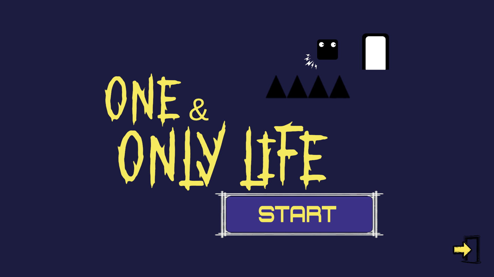
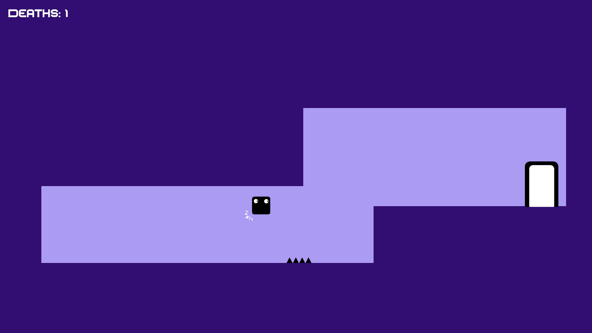
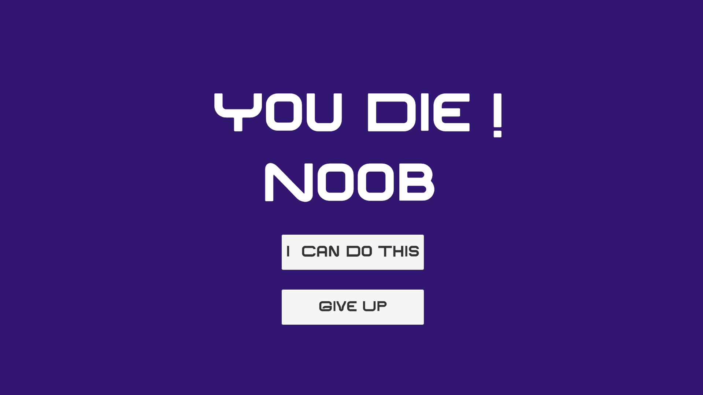

# 🎭 One & Only Life

<p align="center">


</p>

<p align="center">
A <b>2D puzzle platformer</b> inspired by <b>Level Devil</b>, featuring deceptive traps and falling platforms which <b>challenges players to rethink every level</b>
</p>

> **🎮 Original Project**  
> **One & Only Life** was developed during a local game jam as an original project. Inspired by the unpredictable gameplay of **Level Devil**, I designed and implemented my own mechanics, gameplay systems, and levels to create a challenging puzzle-platforming experience.

---

# 📖 Overview

**One & Only Life** is a 2D puzzle platformer where players must navigate through trap-filled levels while adapting to unexpected obstacles and gameplay twists.

The project focuses on responsive player controls, engaging level design, and delivering surprising gameplay moments.

---

# 📸 Screenshots

<p align="center">
    
</p>

<p align="center">
    
</p>

<p align="center">
    
</p>

---

# ✨ Features

- 🎮 Responsive 2D Platforming
- 🎭 Unique Role Swap Mechanic
- ⚠️ Trap-Based Level Design
- 🧩 Puzzle-Oriented Gameplay
- 🚩 Checkpoint System
- ❤️ One Life Challenge
- 🎨 Custom UI & Menus
- 🎵 Background Music & Sound Effects

---

# 🎯 Gameplay Systems

### 🎮 Player

- Responsive movement
- Jump mechanics
- Player interactions
- Checkpoint system
- Death & respawn

### 🧩 Gameplay

- Role Swap mechanic
- Trap interactions
- Puzzle progression
- Level completion
- One-life gameplay design

### 🎨 User Interface

- Main Menu
- Pause Menu
- Level Complete Screen
- Game Over Screen

---

# 🛠️ Technologies Used

| Category | Technologies |
|----------|--------------|
| **Engine** | Unity 6 |
| **Language** | C# |
| **Physics** | Unity 2D Physics |
| **UI** | Unity UI, TextMeshPro |
| **Tools** | Visual Studio, Git |

---

# 🎮 Controls

| Action | Key |
|--------|-----|
| Move | **A / D** |
| Jump | **Space** |
| Pause | **Esc** |

---

# 📚 What I Learned

- Designing engaging gameplay mechanics
- 2D character controller implementation
- Puzzle and level design
- Checkpoint & respawn systems
- UI design and menu creation
- Managing game states
- Writing modular C# gameplay code

---

# 🚀 Future Improvements

- Additional levels
- More trap variations
- New gameplay mechanics
- Better visual effects
- Improved audio feedback
- Level selection system

---

# 📂 Project Structure

```text
Assets
│
├── Prefabs
└── Scenes
├── Scripts
├── SFX
├── Sprites
├── UI
```

---

# 👨‍💻 My Role

This project was developed entirely by me during a local game jam.

**Responsibilities**

- Gameplay Programming
- Character, Level Door design
- Game Design
- Level Design
- UI Design & Implementation
- Player Controller
- Gameplay Mechanics
- Testing & Debugging

---

<p align="center">
⭐ If you found this project interesting, consider giving it a star!
</p>
